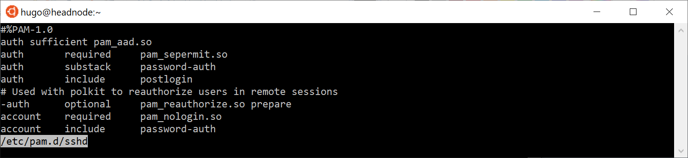

# linuxaad
Libnss, pam and utils for Azure Active Directory support for Linux.

# login example

# Azure Active Directory Schema Extension

To host the linux properties in Azure Active Directory, the following schema extension is used:
https://developer.microsoft.com/en-us/graph/graph-explorer?request=schemaExtensions/extj8xolrvw_linux&method=GET&version=v1.0&GraphUrl=https://graph.microsoft.com.
This extension is now in status Available and thus usable in any Azure Active Directory Tenant.

The libnss_aad lib looks at the following properties:
  * passwd lookups: 
    * user (string, linux login name)
    * passwd (string, advised to keep empty)
    * uid (integer, linux uid, must be unique)
    * gidnumber (integer, primary group gid)
    * gecos (string, may be empty)
    * homedir (string, e.g. /home/\<user\>)
    * shell (string, e.g. /bin/bash)

  * shadow lookups:
    * user (string, linux login name)

  * group lookups:
    * group (string, linux group name)
    * gid (integer, group gid)

Group members are obtained from the actual members in the AAD group; the members field in the extension is not used.

# installing and enabling

Libnss_aad.so.2.0 must be placed in /usr/lib64 for CentOS and to ensure compatibility, softlinks to libnss_aad.so and libnss_aad.so.2 should be created.
In /etc/nsswitch.conf, aad must be added to the passwd, shadow and group entries.

Pam_aad.so must be placed in /usr/lib64/security. To use pam_aad with ssh, add the line "auth sufficient pam_aad.so" to the /etc/pam.d/sshd file. 
Also make sure to enable "PasswordAuthentication yes" in /etc/ssh/sshd_config.

Both libraries use the /etc/azuread/parameters.json file to look up the tenant, the client-id. Libnss_aad also uses the client secret to get access to the user properties in Azure Active Directory.

`{
  "authority": "https://login.microsoftonline.com/<your AAD tenant name>",
  "client_id": "<your client id>",
  "scope": [ "https://graph.microsoft.com/.default" ],
  "secret": "<your client secret>",
  "endpoint": "https://graph.microsoft.com/v1.0/users"
}`

At this moment, selinux should be disbaled.

# build on work from others
This code is based on a lot of the work of https://github.com/gmjosack/nss_http, which is originally licensed with MIT license.
