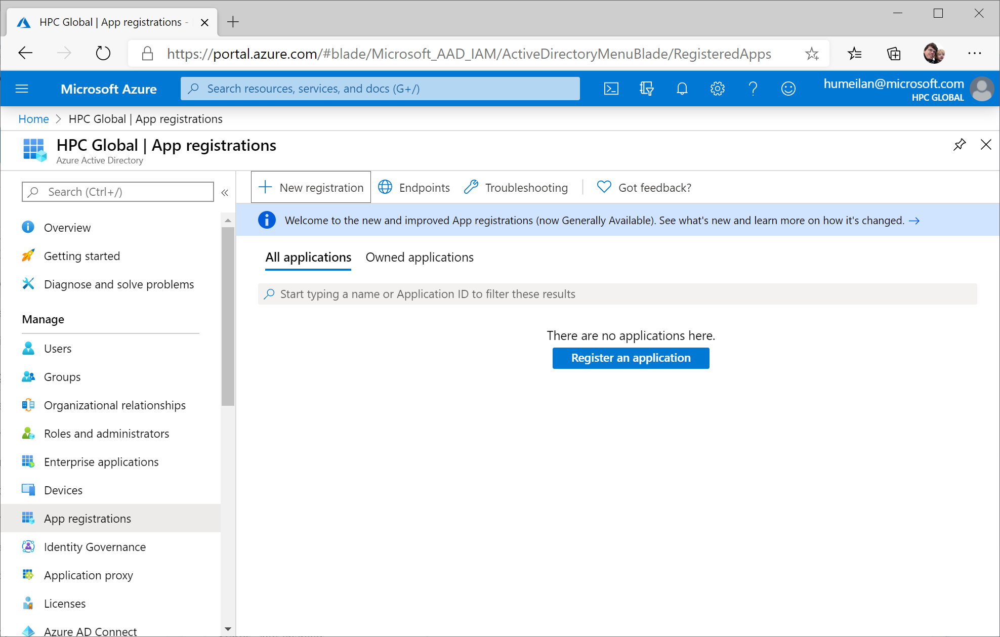
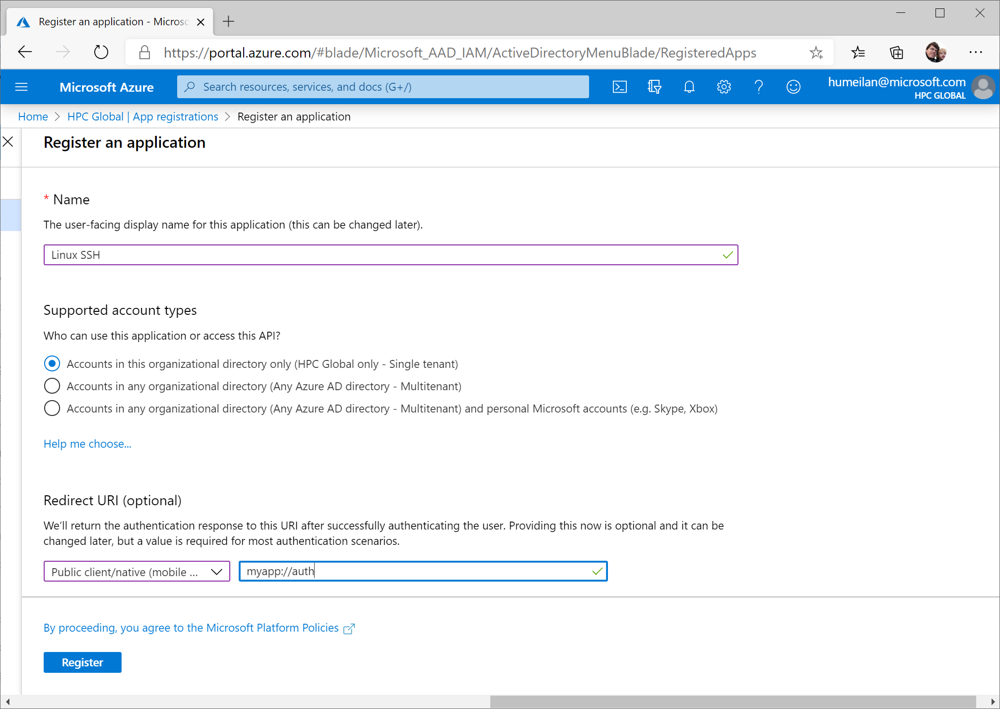
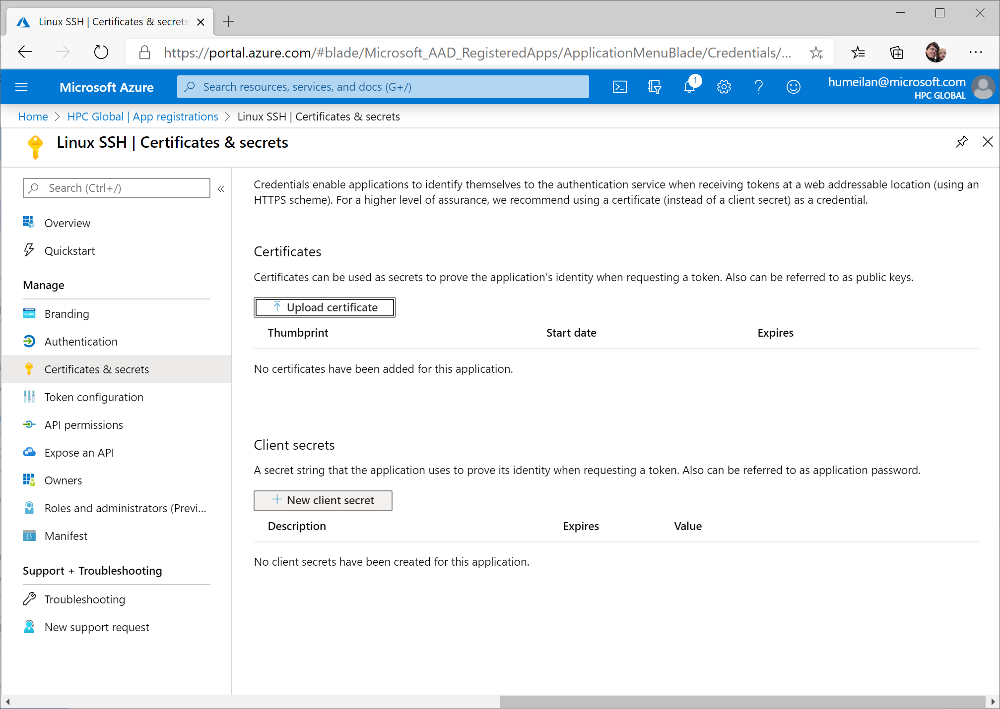
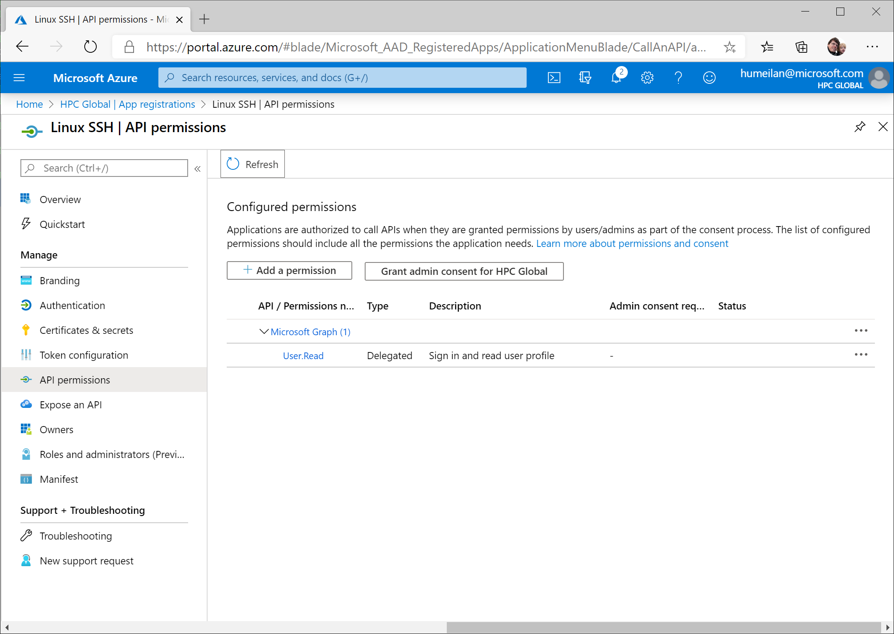
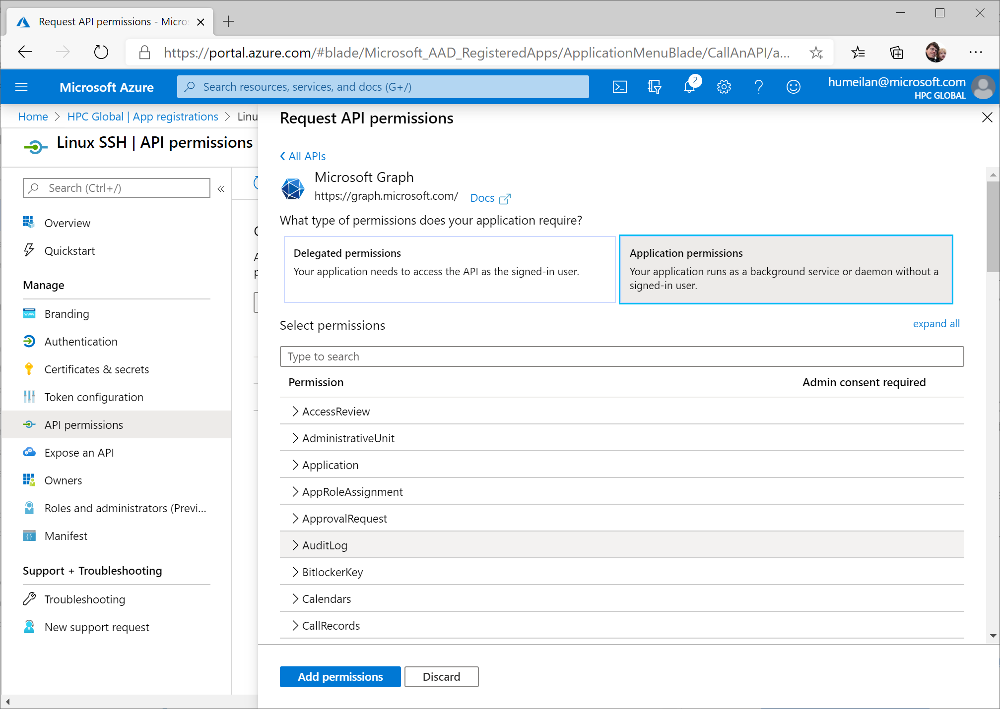
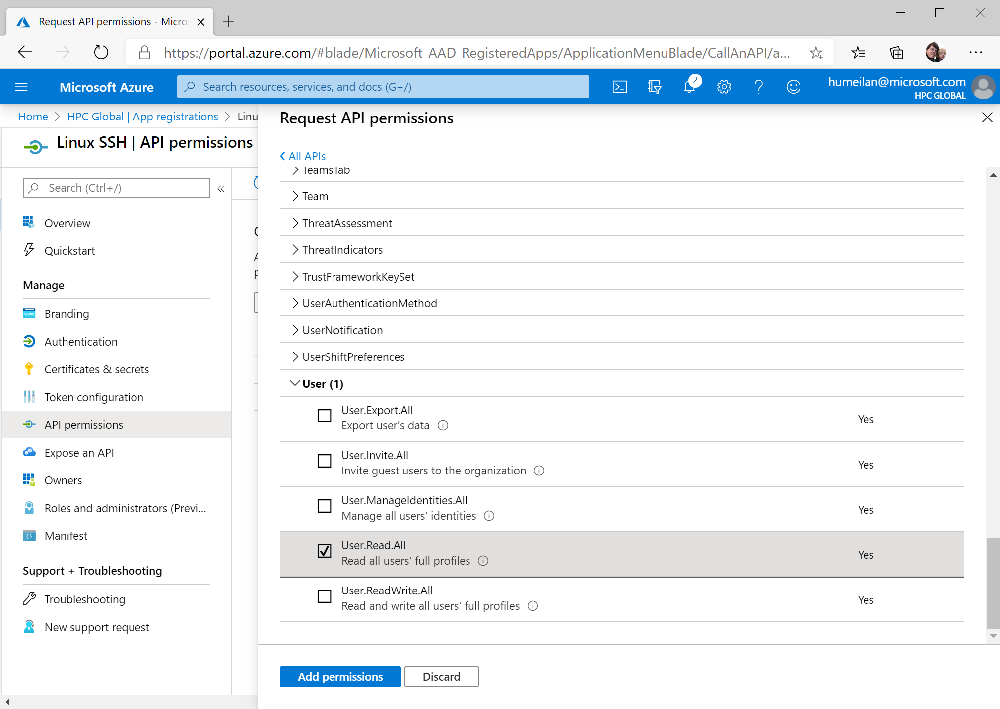
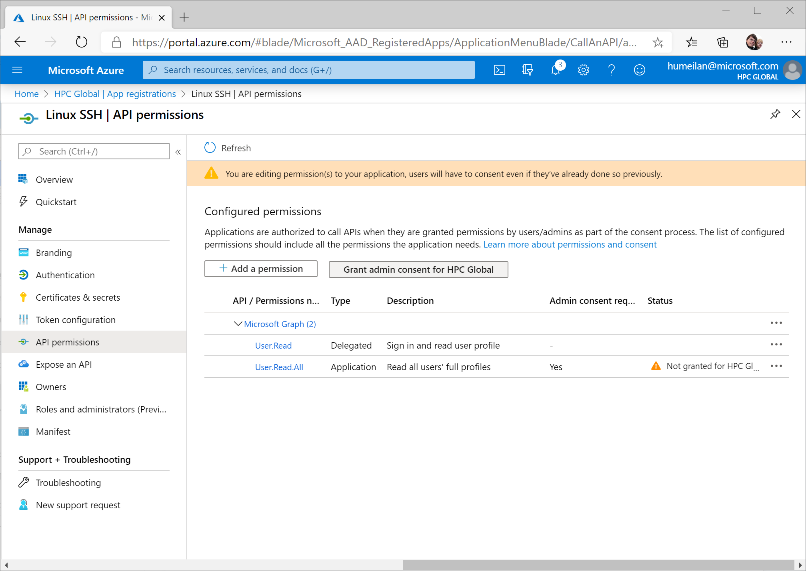
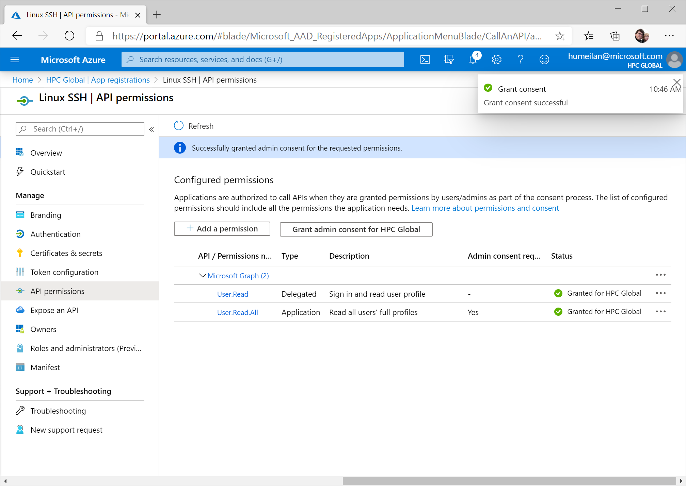

## steps to register apps for access to Microsoft Graph

For this demo I've created a brand new tenant; so it is completely empty. 

Go to the App registrations page and press 'New registration'.

Now set the name which will be displayed during PAM login through the device login session; leave the scope limited to single tenant.
Also set the redirect URI, this is required to be able to use the device login, this can/will be a fake URI, so using the example is fine.
Press 'Register' to proceed. 

Go to the 'Certificates & secrets' tab to create the client secret to be used in the parameters.conf file. Press new client secret and give it an arbitrary name. 
The secret will only be shown once, but multiple secrets can be created.

Next step is the API permissions, the default permission is to have User.Read access, but this is not enough for the libnss_aad library, since it needs access to all users. For this,
press 'Add a permission',

Select Application permissions, since the libnss_add library will be working stand-alone.

And scroll all the way down to User and select 'User.Read.All'. This is specific for the app-id and secret that is going to be used by the libnss_aad and pam_aad library.
For the utilities like useradd-aad, also Write permission is required, so choose 'User.ReadWrite.All' for that app. Since this secret is going to be distributed on all Linux machines;
it is best practise to keep the limits as tight as possible. Now press 'Add permissions'to continue.

Now also press 'Grant admin consent for \<tenant\>' to approve the permissions for the whole tenant. 

Now your ready to go!

